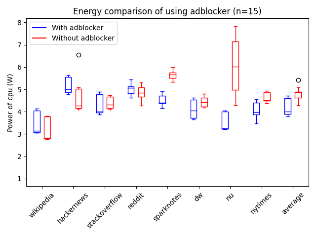

# Hier kan uw advertentie staan
<!--- 
Introduction:
Billion dollar industry
Ads on websites needed, but what is the impact on power consumption
Not only important for mobile websites (more screen real estate, more possibilities for ads)
reference to papers
--->

Showing advertisements is one of the key ways to earn money on the internet. Whether it is through banner ads¸ sponsored messages or paid endorsements, advertising is everywhere. The online advertising industry is one of the fastest growing industries. In the Netherlands alone, [it grew by more than 100% in 8 year](https://www.statista.com/statistics/542808/net-online-advertising-market-revenue-in-the-netherlands-by-channel/). But what footprint does this industry leave behind? Large advertising companies like [Google](https://sustainability.google/commitments/carbon/#) and [Meta](https://sustainability.fb.com/climate/) have great ambitions of reaching net-zero emissions. However, their goals only apply to their own corporate emissions, such as the energy usage of their datacenters or offices.

Given the fact that the services of advertising companies are consuming energy both the server *and* the client side, the effect of advertising on the energy consumption of clients should not be forgotten. As more and more money is spent on digital advertising, this becomes increasingly more important.

<<TODO: image of ad market increase\>>

Users are becoming more ad aware, and there are many different tools for reducing the amount of advertising you see when browsing. As you can see in the image below, adblock usage is becoming more popular. Already 763 million people use adblockers worldwide. This shows annoyment towards online advertising, and makes it more difficult for websites to be profitable. However, the sustainability impact of trying to block advertisements and trackers is most often not part of people's consideration. Does this blocking increase your browser's energy consumption to find the ads? Or is it actually saving your battery by reducing the amount of images that have to be downloaded?

<<TODO: image of adblock usage\>>

This will be the goal of our experiment. We will measure the effect that advertisements and adblockers have on the additional energy usage of of our own devices. In [previous work](https://dl.acm.org/doi/10.1145/3372799.3394372) there have already been efforts to determine the power consumption of smart phones. However with the relatively more screen real-estate to fill, advertisements  can take up more space on the screens on full-size screens of desktops and laptop computers.

<!--- 
Setup:
What did we turn off
Which resources did we use (Jouleit)
Time between tests
Repetitions
--->

Blocking advertisements on computers can be done by using an ad blocker.  like the free and open-source ad blocker [uBlock Origin](https://github.com/gorhill/uBlock/). We wrote automated tests for [Selenium](https://www.selenium.dev/) to make experiment as replicable as possible. The tests were run with Selenium with [geckodriver](https://github.com/mozilla/geckodriver).

The testsuite was executed on the same set of sites, with the only difference being whether uBlock Origin was installed. Due to the previous research In combination with the use of selenium, we were able to automate the visit of different websites, such that the experiments could be repeated 15 times. With the [jouleit](https://github.com/powerapi-ng/jouleit) script from powerapi, the power consumptions during these website visits was measured. Now we just need to find some interesting websites to measure the power consumption of. We came up with the following list of websites, ranging from no advertisements at all to a lot of ads on a single page. 

We judged the ad intensity ourselves to place the websites in 4 categories, as you can see in the table below. They link to the exact page we used, so you can also have a look for yourself! We also list here, how many requests the adblocker is blocking, which also takes into account requests that are less visible.

| Website | Ad intensity | # of requests |
| --- | --- | --- |
| [Wikipedia](https://en.wikipedia.org/wiki/Main_Page) | No ads | 0 (0%) |
| [Hackernews](https://news.ycombinator.com) | No ads | 0 (0%) |
| [Stackoverflow](https://stackoverflow.com/questions/tagged/selenium) | Low | 2 (7%) |
| [Reddit](https://reddit.com) | Low | 32 (3%) |
| [Sparknotes](https://www.sparknotes.com/cs/) | Medium | 7 (16%) |
| [Deutsche Welle](https://www.dw.com) | Medium | 11 (7%) |
| [nu.nl](https://nu.nl) | High | 12 (7%) |
| [New York Times](https://nytimes.com) | High | 15 (10%) |

We decided to not preheat the system as normally is done in such tests, since the preheating is not done in regular use of the webbrowser either. A user normally loads website one by one, therefore the CPU would not be pre-heated in a regular scenario. In order to prevent as much deviation between tests as possible we opted to use a wired connection to the internet and disable bluetooth as well. No other programs were running during execution. In the figure below, it can be seen that this resulted in quite consistent durations for the experiment. Only XX out of XX experiments did not finish successfully, we removed these from the data.

Total power consumption consists of two parts, the energy consumed during the visit and the time spent. Below you will find a box plot of the time spent in watching the webpage. The time spent on every website is not equal since some websites are longer compared to others. We decided to take the actual use case in consideration and to differ the amount of time spent reading each website over an equal time. This should not skew the results, since we will compare the ad-free websites relative to their ad-full variant.

In every test, we reloaded the website 3 times. Selenium was used to scroll from top to bottom each time, in order to load all page content and ads. We repeated this for 15 iterations with and 15 iterations without adblocker for every website. The execution order of the tests was randomly shuffled to reduce external effects. We only used Firefox as a browser, but created the skeleton for easy future experiments with other browsers. We disabled all built-in blocking features that Firefox offers, to only have the effects of the adblocker.

<!--- 
Results & Graph(s):
Is it a Normal distribution
Show stanadard deviation

--->

The results can be seen in the table. It can be clearly seen that when scrolling on a page without any ads (Wikipedia and Hackernews), using an adblocker consumes more energy. This energy consumption can be explained by the fact that the adblocker still has to go through the page to see if there are any ads. The same can be see in a milder version for the webpages with only a few ads. The extra energy consumption is here partly compensated by the reduced cost from not having to load the images and animations in the ad. When visiting websites with higher ad intensity, this saved effort is actually so much, that quite a lot of energy can be saved by turning on an adblocker.

<<TODO: replace table with new data, maybe add effect size>> 

| Website | Average power usage with adblocker (W) | Average power usage without adblocker (W)| Change |
| --- | --- | --- | --- |
| Wikipedia | 0.1773 | 0.1433 | 23.71% | |
| Hackernews | 0.4221 | 0.3462 | 21.91% | |
| Stackoverflow | 0.283 | 0.2598 | 8.95% |
| Reddit | 0.3367 | 0.3111 | 8.22% |
| Sparknotes | 0.2518 | 0.4466 | -43.62% |
| Deutsche Welle | 0.2509 | 0.2604 | -3.66% |
| Nu | 0.151 | 0.4206 | -64.09% |
| NYtimes | 0.2366 | 0.2751 | -13.98% |
| Mean | 0.2395 | 0.3097 | -22.67% |

In the figure below, it can be seen that power consumption was not completely stable over iterations. The red boxplots show the distribution of the results without adblocker, the blue boxplot with uBlock activated. The websites on the left of the plot have less ads, more to the right means more ads. In general, it was expected that power is not very stable, but the distributions seem to show that the effect of the adblocker is definitely visible.

<!--- Image of with and without ads (boxplot and/or violin plot) --->

Due to the small sample size of websites we are unable to say something about the entire surfing behaviour of users. Especially because of the distributed nature of the internet. If one would like to determine the entire amount of energy saved the shown ads also play a role. If a lot of animated ads are shown at the moment, it might be more effective to use an ad blocker compared to a moment when only static ads are shown.

<!--- 
Discussion:
What went right 
where can the tests be improved  
What is the impact on society?
How can the current situtation be changed
--->

First of all, from the perspective of a web user, it can be seen that your adblocker has significant impact on the amount of power you use while browsing. Especially if you are often on pages with a lot of ads, it could be beneficial from both a sustainability and a battery life standpoint to use an adblocker. We only used the uBlock adblocker, so more research can be done to compare different adblockers, but we believe this is probably also the case when using a different program. 

As an example, we made the calculation for one of the high ad intensive websites from our experiment. The Dutch newspage 'nu.nl', which shows 2 banners, one static ad and an advertisement that scrolls along. This page reports having around 800 million page loads per month (see [here](https://www.dpgmedia.nl/merken/nu) . Our experiment shows an average energy saving of XX J for every load, this means that every year, XX * 800 million * 12 = XX GJ a year could be saved every year if everyone were to use an adblocker just for this one website. This is equivalent to what XX average households use per year, and this is only for this one website.

Our experiment also shows that there is still a lot to gain in the efficiency of the adblocker. If it would be able to recognize when there are no ads, it would not cost as much extra when browsing on these pages. There may be many more and less complicated ways to achieve more efficient ad recognizing. For example, we believe this could potentially be achieved by whitelisting well-known ad-free websites. This can already be done manually and it could be a nice future experiment to see, whether users can save energy by maintaining this themselves.

Another simple possibility would be to maybe keep more caches, to prevent having to redo this every page. However, it should be noted that for this experiment, we restarted the browser every time. This might also have negatively impacted the adblocker efficiency, as it might use more during start up.

For websites, it is of course difficult to earn their money without ads. It is however possible to take into consideration how much energy this consumes. Maybe looking into smaller or less animated ads could save the user some energy, and motivate the user not to activate a blocker. Or to provide the option for adblocking users to request ad-free or ad-light pages directly instead. This would of course be more efficient than the current way of requesting the full page and then blocking parts.

In general, 'more ads equals more energy consumption' seems a valid conclusion from our results. However, this is not completely consistent. The Sparknotes ads seem to use a lot more extra energy in comparison to Deutsche Welle, while they have a similar intensity. We did not look into enough webpages to be certain what makes ads more or less energy consuming. However, our first intuition is that it has to do with the size of the webpage as well. A large web page, with an advertisement that is only loaded once, but shows it continuously might be more efficient than loading ads on a small page that is only visited for a short duration.

These are some of the many possible more detailed comparison that could be made to interpret these results even more. What is the effect of ad size, the movement of ads, ad provider? But also, what is the effect of using a smaller or larger screen or activating Firefox' trackers blocking?

In our opinion, the real, long-term solution would however be to make wider changes to the system. If it would be possible to pay a small monthly fee, which is spread over all webpages you visit, we could save energy and frustration from advertisements, while keeping the companies providing us with news and information with income. We understand this would be a complicated and long process to change, but maybe this small experiment can provide a little extra motivation!

<!---
Conclusion:
How many kilometers can we ride if we do a 1000 page loads?
--->

Would you like to reproduce the work we did? Use the following package of code we used to get this data.

Written by: Katja Schmahl & Thijs Raymakers & Jeffrey Bouman
